# direct3d11demo

#   Tutorial 1: Direct3D 11 Basics
本示例展示创建一个最小的Direct3D11应用的必要步骤。创建窗口、创建设备对象、显示一个颜色到窗口上。
代码位置[Tutorial 01Basics](https://github.com/iherewaitfor/direct3d11demo/tree/main/Tutorial%2001Basics).

## How to run
先安装cmake，进入源码目录新建build目录。然后在build 目录中进入命令行。然后执行命令
```
cmake .. -G "Visual Studio 17 2022" -A Win32
```
。然后打开生成的sln文件，将Demo项目设置为启动项即可。 cmake使用可参考本github项目[cmakevisualstudio](https://github.com/iherewaitfor/cmakevisualstudio)

```bat
D:\srccode\direct3d11demo\Tutorial 01Basics\build>cmake .. -G "Visual Studio 17 2022" -A Win32
CMake Deprecation Warning at CMakeLists.txt:2 (cmake_minimum_required):
  Compatibility with CMake < 2.8.12 will be removed from a future version of
  CMake.

  Update the VERSION argument <min> value or use a ...<max> suffix to tell
  CMake that the project does not need compatibility with older versions.


-- Selecting Windows SDK version 10.0.22621.0 to target Windows 10.0.19045.
-- The C compiler identification is MSVC 19.33.31630.0
-- The CXX compiler identification is MSVC 19.33.31630.0
-- Detecting C compiler ABI info
-- Detecting C compiler ABI info - done
-- Check for working C compiler: C:/Program Files/Microsoft Visual Studio/2022/Community/VC/Tools/MSVC/14.33.31629/bin/Hostx64/x86/cl.exe - skipped
-- Detecting C compile features
-- Detecting C compile features - done
-- Detecting CXX compiler ABI info
-- Detecting CXX compiler ABI info - done
-- Check for working CXX compiler: C:/Program Files/Microsoft Visual Studio/2022/Community/VC/Tools/MSVC/14.33.31629/bin/Hostx64/x86/cl.exe - skipped
-- Detecting CXX compile features
-- Detecting CXX compile features - done
-- Configuring done
-- Generating done
-- Build files have been written to: D:/srccode/direct3d11demo/Tutorial 01Basics/build

D:\srccode\direct3d11demo\Tutorial 01Basics\build>
```
或者根据你自己电脑安装的不同版本修改对应命令。可参考如下。项目中使用"Visual Studio 17 2022"
```
D:\srccode\direct3d11demo\Tutorial05Transformation\build>cmake -G help
CMake Error: Could not create named generator help

Generators
* Visual Studio 17 2022        = Generates Visual Studio 2022 project files.
                                 Use -A option to specify architecture.
  Visual Studio 16 2019        = Generates Visual Studio 2019 project files.
                                 Use -A option to specify architecture.
  Visual Studio 15 2017 [arch] = Generates Visual Studio 2017 project files.
                                 Optional [arch] can be "Win64" or "ARM".
  Visual Studio 14 2015 [arch] = Generates Visual Studio 2015 project files.
                                 Optional [arch] can be "Win64" or "ARM".
  Visual Studio 12 2013 [arch] = Generates Visual Studio 2013 project files.
                                 Optional [arch] can be "Win64" or "ARM".
  Visual Studio 11 2012 [arch] = Deprecated.  Generates Visual Studio 2012
                                 project files.  Optional [arch] can be
                                 "Win64" or "ARM".
  Visual Studio 9 2008 [arch]  = Generates Visual Studio 2008 project files.
                                 Optional [arch] can be "Win64" or "IA64".
```


## 创建window
就是正常的创建Window的流程。RegisterClassEx，CreateWindow。
## 创建设备对象[D3D11CreateDeviceAndSwapChain](https://learn.microsoft.com/en-us/windows/win32/api/d3d11/nf-d3d11-d3d11createdeviceandswapchain)
首先要创建三个对象： a Device、an imediat context 和 a swap chain。其中 the imediate context是一个Direct3D11引入的新对象（相对旧版Direct3D)。

在Direct3D10中，设备对象用于渲染和资源创建。而在Direct11中，the immediate context 用来渲染到buffer，而the device包含方法创建资源。

The swap chain则用于获取渲染的buffer，以及将内容显示到屏幕上。the swap chain 包含两个或多个buffer。主要包含the front buffer和the back buffer.这些buffer其实是纹理。the Device就是渲染内容到这些纹理上的。the front buffer就是正在显示内容，是只读的。不能修改。the back buffer是设备的渲染目标。一旦完成drawing操作，the swap chain就会通过交换这两个buffer显示the backbuffer。 然后当前 back buffer就变成 front buffer了，反之亦然。

在创建 swap chain前要先填充[DXGI_SWAPCHAIN_DESC](https://learn.microsoft.com/en-us/windows/win32/api/dxgi/ns-dxgi-dxgi_swap_chain_desc)结构。特别注意这几个字段：
- BackBufferUsage：用于指明我们怎么用the backbuffer.在本例中，我们是想把内容渲染到backbuffer，所以我们设置值DXGI_USAGE_RENDER_TARGET_OUTPUT。
- OutputWindow：用于显示的窗口。
- SampleDesc：用于启用多重采样。由于本例没有使用多重采样。SampleDesc的count设置成了1，Quality设置成了0，从而禁用了多重采样。

```C++
    ID3D11Device*           g_pd3dDevice = NULL;
    ID3D11DeviceContext*    g_pImmediateContext = NULL;
    IDXGISwapChain*         g_pSwapChain = NULL;

    DXGI_SWAP_CHAIN_DESC sd;
    ZeroMemory( &sd, sizeof(sd) );
    sd.BufferCount = 1;
    sd.BufferDesc.Width = 640;
    sd.BufferDesc.Height = 480;
    sd.BufferDesc.Format = DXGI_FORMAT_R8G8B8A8_UNORM;
    sd.BufferDesc.RefreshRate.Numerator = 60;
    sd.BufferDesc.RefreshRate.Denominator = 1;
    sd.BufferUsage = DXGI_USAGE_RENDER_TARGET_OUTPUT;
    sd.OutputWindow = g_hWnd;
    sd.SampleDesc.Count = 1;
    sd.SampleDesc.Quality = 0;
    sd.Windowed = TRUE;

    if( FAILED( D3D11CreateDeviceAndSwapChain( NULL, D3D_DRIVER_TYPE_HARDWARE, NULL, 0, featureLevels, numFeatureLevels,
                     D3D11_SDK_VERSION, &sd, &g_pSwapChain, &g_pd3dDevice, NULL, &g_pImmediateContext ) ) )
    {
        return FALSE;
    }

```

## create a render target view
创建完成设备后，接下来就要创建渲染目标视图。
A render target view is a type of resource view in Direct3D 11. A resource view allows a resource to be bound to the graphics pipeline at a specific stage. Think of resource views as typecast in C. A chunk of raw memory in C can be cast to any data type. We can cast that chunk of memory to an array of integers, an array of floats, a structure, an array of structures, and so on. The raw memory itself is not very useful to us if we don't know its type. Direct3D 11 resource views act in a similar way. For instance, a 2D texture, analogous to the raw memory chunk, is the raw underlying resource. Once we have that resource we can create different resource views to bind that texture to different stages in the graphics pipeline with different formats: as a render target to which to render, as a depth stencil buffer that will receive depth information, or as a texture resource. Where C typecasts allow a memory chunk to be used in a different manner, so do Direct3D 11 resource views.

We need to create a render target view because we would like to bind the back buffer of our swap chain as a render target. This enables Direct3D 11 to render onto it. We first call GetBuffer() to get the back buffer object. Optionally, we can fill in a D3D11_RENDERTARGETVIEW_DESC structure that describes the render target view to be created. This description is normally the second parameter to CreateRenderTargetView. However, for these tutorials, the default render target view will suffice. The default render target view can be obtained by passing NULL as the second parameter. Once we have created the render target view, we can call OMSetRenderTargets() on the immediate context to bind it to the pipeline. This ensures the output that the pipeline renders gets written to the back buffer. The code to create and set the render target view is as follows:

```C++
// Create a render target view
    ID3D11Texture2D *pBackBuffer;
    if( FAILED( g_pSwapChain->GetBuffer( 0, __uuidof( ID3D11Texture2D ), (LPVOID*)&pBackBuffer ) ) )
        return FALSE;
    hr = g_pd3dDevice->CreateRenderTargetView( pBackBuffer, NULL, &g_pRenderTargetView );
    pBackBuffer->Release();
    if( FAILED( hr ) )
        return FALSE;
    g_pImmediateContext->OMSetRenderTargets( 1, &g_pRenderTargetView, NULL );
```

The last thing we need to set up before Direct3D 11 can render is initialize the viewport. The viewport maps clip space coordinates, where X and Y range from -1 to 1 and Z ranges from 0 to 1, to render target space, sometimes known as pixel space. In Direct3D 9, if the application does not set up a viewport, a default viewport is set up to be the same size as the render target. In Direct3D 11, no viewport is set by default. Therefore, we must do so before we can see anything on the screen. Since we would like to use the entire render target for the output, we set the top left point to (0, 0) and width and height to be identical to the render target's size. To do this, use the following code:
```C++
    D3D11_VIEWPORT vp;
    vp.Width = (FLOAT)width;
    vp.Height = (FLOAT)height;
    vp.MinDepth = 0.0f;
    vp.MaxDepth = 1.0f;
    vp.TopLeftX = 0;
    vp.TopLeftY = 0;
    g_pImmediateContext->RSSetViewports( 1, &vp );
```

## Modifying the Message Loop

```C++
    MSG msg = {0};
    while( WM_QUIT != msg.message )
    {
        if( PeekMessage( &msg, NULL, 0, 0, PM_REMOVE ) )
        {
            TranslateMessage( &msg );
            DispatchMessage( &msg );
        }
        else
        {
            Render();  // Do some rendering
        }
    }

```
## The Rendering Code
```C++
    void Render()
    {
        //
        // Clear the backbuffer
        //
        float ClearColor[4] = { 0.0f, 0.125f, 0.6f, 1.0f }; // RGBA
        g_pd3dDevice->ClearRenderTargetView( g_pRenderTargetView, ClearColor );
    
        g_pSwapChain->Present( 0, 0 );
    }

```

# Tutorial02 Rendering a Triangle
本例将画一个三角形到屏幕。我们会过一遍和三角形相关的数据结构。本例的输出结果是画一个三角形到窗口的正中央。
## Elements of a Triangle
三个顶点定义了一个三角形。我们怎么把三个顶点传给GPU呢?在Direct3D11中，顶点信息（比如位置信息）存储在buffer资源里的。存储顶点的buffer叫vertext buffer。所以我们必须创建一个足够大的vertext buffer存储这三个顶点的信息，并且填充顶点位置信息。在Direct3D11中，在创建buffer资源时，应用必须指明buffer的大小是多少字节。我们知道三个顶点就够了，但每个顶点的需要多少个字节呢？为了回答这个问题，我们就需要理解 vertex layout了。（顶点布局）
## Input Layout  D3D11_INPUT_ELEMENT_DESC
顶点有位置信息。通常顶点同时还有其他信息，比如法线，一个或多个颜色，纹理坐标等等。Vertext layout定义了这些属性在内存的布局：属性的数据类型，个数，这些属性在内存中的顺序等。顶点通常使用一个结构表示。顶点的大小可以很方便地使用结构的大小表示。
本例我们只使用到了位置信息。使用了XMFLOAT3类型。这个类型表示一个有3个点的vector.

```C++
struct SimpleVertex
{
    XMFLOAT3 Pos;  // Position
};
```

我们现在有一个结构表示顶点了。我们存储了顶点信息在我们的应用的系统内存里。但是，当我们传包含我们顶点的vertext buffer给GPU时，我们只是给了一块内存。GPU必须知道vertext layout，才能正常从buffer中解析出顶点的各个属性。给了解决这个问题，我们需要使用到 input layout.。在Direct3D11中，input layout是一个用来描述顶点结构的Direct3D对象，以便GPU能理解。每一人上顶点属性使用[D3D11_INPUT_ELEMENT_DESC](https://learn.microsoft.com/en-us/windows/win32/api/d3d11/ns-d3d11-d3d11_input_element_desc)描述。应用定义了一个D3D11_INPUT_ELEMENT_DESC数组来描述 顶点的input layout.
本例中，因为我们的顶点的属性只有一个，所以我们input layout的描述数组，只有一个元素。
```C++
// Define the input layout
D3D11_INPUT_ELEMENT_DESC layout[] =
{
    { "POSITION", 0, DXGI_FORMAT_R32G32B32_FLOAT, 0, 0, D3D11_INPUT_PER_VERTEX_DATA, 0 },  
};
UINT numElements = ARRAYSIZE(layout);

```

## Vertext Layout
创建vertext layout对象需要vertext shader的input签名。
我们使用ID3DBlob对象(从D3DX11CompileFromFile返回)来获取表示vertextshader的input签名的二进制数据。获取到这一数据，我们就可以立即调用 ID3D11Device::CreateInputLayout() 创建vertext layout对象，使用ID3D11DeviceContext::IASetInputLayout() 来设置它成为被激活的vertext layout。
```C++
// Create the input layout
if( FAILED( g_pd3dDevice->CreateInputLayout( layout, numElements, pVSBlob->GetBufferPointer(), 
        pVSBlob->GetBufferSize(), &g_pVertexLayout ) ) )
    return FALSE;
// Set the input layout
g_pImmediateContext->IASetInputLayout( g_pVertexLayout );
```
## Creating Vertex Buffer
在初始化时，我们还必须创建vertext buffer来存储我们的顶点数据。在Direct3D11中，为了创建vertext buffer，我们需要先填充两个结构：D3D11_BUFFER_DESC 和 D3D11_SUBRESOURCE_DATA，然后调用ID3D11Device::CreateBuffer()。D3D11_BUFFER_DESC描述vetex buffer对象，D3D11_SUBRESOURCE_DATA描述在创建时复制到vertex buffer的实际数据。创建完后，使用ID3D11DeviceContext::IASetVertexBuffers()来绑定vertex buffer 到设备。
```C++
// Create vertex buffer
SimpleVertex vertices[] =
{
    XMFLOAT3( 0.0f, 0.5f, 0.5f ),
    XMFLOAT3( 0.5f, -0.5f, 0.5f ),
    XMFLOAT3( -0.5f, -0.5f, 0.5f ),
};
D3D11_BUFFER_DESC bd;
ZeroMemory( &bd, sizeof(bd) );
bd.Usage = D3D11_USAGE_DEFAULT;
bd.ByteWidth = sizeof( SimpleVertex ) * 3;
bd.BindFlags = D3D11_BIND_VERTEX_BUFFER;
bd.CPUAccessFlags = 0;
bd.MiscFlags = 0;
D3D11_SUBRESOURCE_DATA InitData; 
ZeroMemory( &InitData, sizeof(InitData) );
InitData.pSysMem = vertices;
if( FAILED( g_pd3dDevice->CreateBuffer( &bd, &InitData, &g_pVertexBuffer ) ) )
    return FALSE;

// Set vertex buffer
UINT stride = sizeof( SimpleVertex );
UINT offset = 0;
g_pImmediateContext->IASetVertexBuffers( 0, 1, &g_pVertexBuffer, &stride, &offset );
```
## Primitive Topology
表示两个三角形的两种topology
- triangle list: ABC CBD
- triangle strip: ABCD

```C++
// Set primitive topology
g_pImmediateContext->IASetPrimitiveTopology( D3D11_PRIMITIVE_TOPOLOGY_TRIANGLELIST );
```
## Rendering the Triangle

最后我们需要 调用 ID3D11DeviceContext::Draw()。该函数命令GPU使用当前的vertex buffer，vetex layout和基元topology。第一个参数是发送给GPU的顶点数量，第2个参数第一个被发磅的顶点的索引。因为本例中，我们只画一个三角形，并且是从vertex buffer的开头元素开始传的，所以我们用了3和0.
```C++
// Render a triangle 
g_pImmediateContext->VSSetShader( g_pVertexShader, NULL, 0 );
g_pImmediateContext->PSSetShader( g_pPixelShader, NULL, 0 );
g_pImmediateContext->Draw( 3, 0 );
```
# Tutorial 03 Shaders
本例将单独解释什么是shader，以及它们是怎么工作的。为了理解各个shader，我们将了解整个图形管线。如下图：


在教程2中，我们调用 了VSSetShader()和PSSetShader()，实际上是将shader绑定到管线对应阶段。然后当我们调用 了Draw之后，我们开始处理已经传到图形管线上的顶点数据。下面的部分将详细描述 Draw之后发生的事情。

## Shaders
在Direct3D11中，各个shader位于图形管线的不同阶段。它们是由GPU执行的很短的程序。取特定的输入数据，处理这些数据，然后输出结果给到管线的下一阶段使用。Direct3D11支持3种基本的shader: vertex shader， geometry shader和pixel shader。
- vertext shader： 以vertex为输入。由vertex buffer输入给GPU的顶点，都会跑一次这个程序。
- geometry shader: 以基元作为 输入。传给GPU的基元都会跑一次。基元可能是一个点，线或者三角形
- pixel shader: 以像素（也叫fragment)作为输入。我们将渲染的基元的每个像素都会跑一次。

vertex， geometry, 和pixel shader就是各个动作发生的核心。当我们使用Direct3D11渲染时，GPU必须要有合适的vertex shader(顶点着色器)和pixel shader。Geometry shder是Direct3D11的高级特性，是可选的。本教程不做讨论。

## Vertex Shaders（顶点着色器）
Vertex shader是由GPU针对顶点运行的短程序。可以把vertex shader比作这样的C函数：以vertext作为输入，处理这输入，然后输出修改过的顶点。在应用以vertex buffer的方式传顶点数据给GPU后，GPU遍历在vertext buffer的所有顶点，并且对每个顶点执行激动的vertex shader。传顶点数据给vertext shader作为入参。
vertext shader可以用来执行多种任务。vertext shader最生分的工作就是转换。转换是将向量从一个坐标系统转换到另一个的过程。比如，在3D场景的一个3角形，顶点是(0,0,0)(1,0,0)(0,1,0)。当这个三角被画到2D的texture buffer时，GPU必须知道这些顶点将要画到的vertex buffer中对应的点的2D坐标。转换帮助我们完成此类任务。转换会在下一教程中讨论。在本教程中，我们会使用一人上简单的 vertext shader。它除了将输入作为输出 ，什么都不做。
High-Level Shading Language（HLSL)

```C++
    float4 VS( float4 Pos : POSITION ) : SV_POSITION
    {
        return Pos;
    }
```
这个vertext shader看似C函数。HLSL用类C语法，以便让C/C++程序员更易学习。这个vertex shader，名叫VS，以float4类型为入参，输出一个float4值。在HLSL中，一个float4是一个包含4个元素的向量，每个元素都是一个浮点型数字。两个冒号分别定义了入参的语义 和返回值的语义。如上所述，HLSL中的语义描述了数据的性质。在我们上面的shader中，我们选择了POSITiON作为入参位置的语义，是因为这个参数必须包含顶点的位置。返回值的语义SV_POSITION是一个有特定含义的预定义的语义。这个语音告诉图形管线，和这个语义关联的数据定义了clip-space位置。GPU需要此位置才能在屏幕上绘制像素。（我们将在下一教程讨论clip-space）。在我们的shader中，我们输入位置 数据，并输入同样的数据到管线上。

## Pixel Shaders（像素着色器）
现代计算机显示器通常是光栅显示器。这意味着显示屏实际上是由一个个叫像素点组件 二维网格。每个像素包含一个独立的颜色。当我们在显示屏上渲染一个三角形时，我们实际上并不是作为一个整体渲染这个三角开，而是我们点亮了这个三角形覆盖一区域中的这些像素点。如下图所示。右边为实际情况。

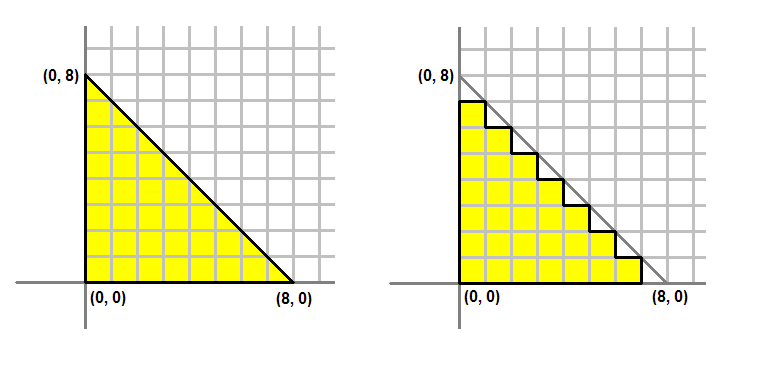

将三个顶点定义的三角形转换成被这个三角形覆盖的一组像素的过程，叫做光栅化。GPU首先要确定哪些像素点是正在被渲染的三角形所覆盖。然后它调用 激活的pixel shader去处理每一个被覆盖的像素。pixel shader主要的作用是去计算每一个pixel的颜色。pixel shader接受特定的关于这个像素将怎样着色的输入，计算这个像素的颜色，然后输出颜色到管线 上。这个输入来自激活的geometry sahder。或者如果geometry sahder不存在的话，如本教程这样，输出直接来自vertex shader。

我们之前的创建的vertext shader 输出 了一个语义是SV_POSITION的float4。这个将是我们pixel shader的输入。因为pixel shader输出 颜色值，我们pixel shader的输出将是float4。我们为输出提供语义SV_TARGET，以表示输出到渲染目标。
```C++
    float4 PS( float4 Pos : SV_POSITION ) : SV_Target
    {
        return float4( 1.0f, 1.0f, 0.0f, 1.0f );    // Yellow, with Alpha = 1
    }

```

## 创建shaders 
D3DX11CompileFromFile

```c++
    // Create the vertex shader
    if( FAILED( D3DX11CompileFromFile( "Tutorial03.fx", NULL, NULL, "VS", "vs_4_0", D3DCOMPILE_ENABLE_STRICTNESS, NULL, NULL, &pVSBlob, &pErrorBlob, NULL ) ) )
        return FALSE;

    // Create the pixel shader
    if( FAILED( D3DX11CompileFromFile( "Tutorial03.fx", NULL, NULL, "PS", "ps_4_0", D3DCOMPILE_ENABLE_STRICTNESS, NULL, NULL, &pPSBlob, &pErrorBlob, NULL ) ) )
        return FALSE;

```

在我们过一遍图形管线后，我们开始理解渲染一个三角开的过程了。关键两步。
1. 在顶点数据中创建资源数据
2. 创建各个shader：转换这些数据进行渲染。

# Tutorial04 3D Spaces
在本教程，我们将深入研究3D位置和转换的细节。 本教程的输出结果是一个被渲染到屏幕的3D对象。
## 3D Spaces(3维空间)

在上个教程中，三角形的顶点被特意放置，以其在屏幕上完美对齐。然后情况并百都是如此。因此我们需要一个在3D空间中表示对象的系统和显示它们的系统。

在现实世界中，物体存在于3维空间中。这意味着，要将对象放置在世界上的特定位置，我们需要使用坐标系，并定义该 位置对应的三个坐标。在计算机图形学中，3维空间通常是使用迪卡尔坐标系。在这个坐标系中，相互垂直的三个轴X、Y和Z，决定 了空间中每个点的坐标。这坐标系统还进一步分为左手系和右手系。在左手系中，当X轴指出右，Y轴指向上时，Z轴指向前。在右手系中，当同样的X、Y指向，Z轴指出后。

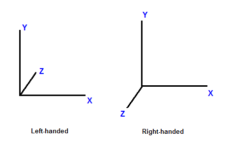

现在我们已经讨论了考虑三维空间时的坐标系。一个定在不同的空间中，会有不同的坐标。比如在一维空间中，假设我们有一个买尺子，我们标记一个点P,标记在尺子5寸的位置 。现在如果我们向右移动尺子1寸，同样的点，躺在了4寸的位置 。通过移动尺子，参考系发生了变化。因此虽然该点没有移动 ，但它已经有了新的坐标。

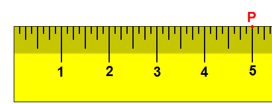

在3D中，空间通常由一个原点和来自该原点的三个唯一轴定义：X、Y和Z。在计算机图形学中，常用的空间有：对象空间、世界空间、视图空间和屏幕空间。

## Object Space 对象空间

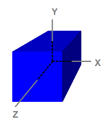

注意这个立方体是以原点为中心的。对象空间也叫模型空间，是指艺术家在创建三维模型时使用的空间。通常艺术家创建模板时是以原点为中心的，这样更易于执行诸如旋转等转换，我们后续将废教讨论转换。以下八个点的坐标如下：
```
    (-1,  1, -1)
    ( 1,  1, -1)
    (-1, -1, -1)
    ( 1, -1, -1)
    (-1,  1,  1)
    ( 1,  1,  1)
    (-1, -1,  1)
    ( 1, -1,  1)
```

因为对象空间是世界在设置和创建模板时使用的。所以这些存储在磁盘的模型也是在对象空间中。应用程序 可以创建vertex buffer表示模型，并使用模型数据初始化vertext buffer。因此通过在vertex buffer中的顶点也是在对象空间中。这也意味着，vertex shader接收的输入顶点数据在模型空间中。

## world Space 世界空间
**世界空间是场景中每个对象共享的空间**。它用于定义要渲染的对象之间的空间关系。为了可视化世界空间，我们可以想象我们站在一个朝北的长方形房间的相关西南角。我们将脚所处的角定义为原点(0,0,0)。则X轴指向我们右边，Y轴指向上，Z轴指向前，和我们面向的方向一致。当我们这样做后，房间中的每一个点都可以通过一组XYZ坐标标记。比如可能会有一把椅子在我们前面5尺，右边2尺的位置。也可能8英尺高的天花板上有一盏灯，就在椅子的正上方。我们可以称椅子的位置为(2,0,5)，灯的位置为（2，8，5）。正如我们所看到的，世界空间之所以被称为“世界空间”，是因为它们告诉我们物体在世界上彼此之间的关系。

## View Space 视图空间

视图空间（有时称为摄影机空间）与世界空间相似，**通常用于整个场景**。然后，在视图空间，原点是观察者或者摄像机。观察方向（观察者目视方向）定为Z轴的正方向。应用程序定义的“向上”方向变为正Y轴，如下所示。

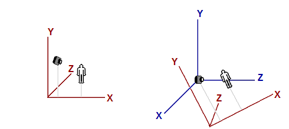

左图显示了一个场景，该场景由一个类似人类的对象和一个观察该对象的观察者（相机）组成。世界空间的原点和轴用红色显示。右图显示了与世界空间相关的视图空间。视图空间的轴用蓝色显示。为了更清楚地说明，视图空间与读者左侧图像中的世界空间的方向不同。请注意，在视图空间中，观察者在Z方向上观看。

## Projection Space 投影空间
投影空间是指从视图空间应用投影变换后的空间。在此空间中，可见内容的X和Y坐标范围为-1到1，Z坐标范围为0到1。

## Screen Space
屏幕空间通用用于指帧缓冲区中的位置。因为 帧缓冲区通常是一个2D纹理，所以屏幕空间是一个2维空间。左上角是原点，坐标是(0,0)。正X指出右，正Y指向下。对于宽w像素、高h像素的缓冲区，最右下角的像素的坐标是（w-1, h-1)。

## 空间到空间的变换。
变换最常用于将顶点从一个空间变换到另一个空间。在3D计算机图形中，逻辑上有三种 这样的变化：世界、视图和投影变换。下一教程将介绍单个变换，如平移、旋转和缩放。

## 世界变换
世界变换，如名所示，将对象的顶点从对象空间变换到世界空间。它通常由一个或多个缩放、旋转和平衡组成，这取决于我们要给对象的大小、方向 和位置。**场景中的每个对象都有自己的世界变换矩阵。这是因为每一个对象有自己的大小 、方向和位置**。

##  view Transformation 视图变换。
顶点转换到世界空间后，视图变化 装饰这些顶点从世界空间转换到视图空间。回想一下前面的讨论，视图空间是从观察者（或相机）的角度看世界的样子。在视图空间中，观察者位于沿正Z轴向外看的原点。

值得注意的是，虽然视图空间是观察者参照系中的世界，但**视图变换矩阵应用于顶点**，而不是观察者。因此，视图矩阵必须执行我们应用于观察者或相机的相反变换。例如，如果我们想将相机向负Z方向移动5个单位，我们则需要计算视图矩阵，该矩阵可以转换顶点沿着正Z方向移动5个单位。虽然相机已向后移动，但从相机的视角，这些顶点是向前移动。在XNA Math中，通常使用一个便捷的API调用XMMatrixLookAtLH（）来计算视图矩阵。我们只需要简单地告诉这个API，观察者在哪里，从哪里观看，表示观察者顶部的方向（也叫向上向量），就可以得到一个对应的视图矩阵了。

## Projection Transformation 投影变换
投影变换将顶点从三维空间（如世界空间和视图空间）转换到投影空间。在投影空间中，顶点的X和Y坐标由该顶点在三维空间中的X/Z和Y/Z比率获得。

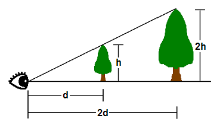

在三维空间中，事件以透视方式出现。也就是说，物体越靠近，它看起来越大。如上图所示，距离观察者眼睛d个单位的h个单位高的树的顶端  将出现在与另一棵2个单位高、2个单位远的树的顶部相同的位置。因此，顶点出现在2D屏幕上的位置与其X/Z和Y/Z比率直接相关。

定义3D空间的参数之一叫视场(FOV)。FOV表示在特定方向观察时，从特定位置 可以看到哪些对象。人类的视野是看向前方的（我们看不到身后的东西），也看不到太近或太远的物体。在计算机图形学中，FOV包括在视锥里。视锥由3D空间的6个平面定义。其中两个是相互平等的XY平面。它们分别称为近Z和远Z平面。其他四个平台由观察者的水平和垂直视野定义。FOV越宽，视锥体积就睵大，观察者看到的物体就越多。

GPU会过滤掉在视锥体外面的对象，这样它就不需要花时间去渲染不需要显示的东西了。这一过程叫裁剪。视锥体是一个四面棱锥体，其顶部被切掉。对这个体积进行裁剪非常复杂，因为要对一个视锥体的平台进行裁剪，GPU必须将每个顶点与平面的方程进行比较。取而代之的，GPU通常首先执行投影变换，然后对视锥体的体积进行裁剪。投影变换对视锥体的影响是，棱锥形视锥体在投影空间中变成一个长方体。这是因为，如前所述，在投影空间中，X和Y坐标基于三维空间中的X/Z和Y/Z。因此，点a和点b在投影空间中具有相同的X和Y坐标，这就是视锥体变为长方体的原因。

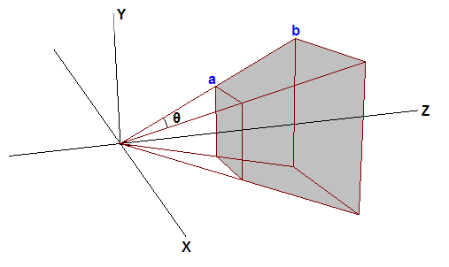


如上图，假设两个棵树的顶部刚好在视锥体的顶部边缘。进一步假设d=2h。投影空间中沿上边缘的Y坐标将为0.5（因为h/d=0.5)。因此，投影后大于0.5的任何Y值都将被GPU裁剪掉。这里的问题是，0.5由程序选择的垂直视野决定，不同FOV值导致GPU必须裁剪人值不同。为了使用处理更方便，3D程序通常会缩放顶点的投影X和Y值 ，使用可见的X和Y的值范围从-1到1。换句话说，任何X或Y坐标超出[-1,1]范围的对象都将被裁剪掉。要使此裁剪方案有效，投影矩阵必须按h/d或d/h的倒数缩放投影顶点的X和Y坐标。d/h也是FOV一半的余切(cotangent)。通过缩放，视锥体的顶部变为h/d*d/h=1。大于1的任何值都将被GPU裁剪掉。这就是我们想要的。

通过也会对投影空间中的Z坐标进行类似的调整。我们希望近Z平面和远Z平面 在投影空间中分别为0和1.当Z=3D空间中的近Z值时，投影空间中的Z应为0；当Z=3D空间中的远Z时，投影空间中的Z应为1.完成此操作后，GPU将裁剪掉[0,1]以外的任何Z值。

在Direct3D11中，获取投影矩阵的最简单方法是调用XMMatrixPerspectiveFovLH()方法。我们只需要提供4个参数FOVy、Aspect、Zn和Zf，就可以得到一个矩阵，它可以完成上面提到 的所有必要的工作。FOVy是Y方向 的视野。Aspect是横纵比，它是视图空间宽度与高度的比率。根据FOVy和Aspect，可以计算FOVx。此横纵比通常从渲染目标宽度与高度的比率获得。Zn和Zf分别是视图空间中的近Z值 和远Z值。

## Using Tansformation使用变换
在上一教程，我们写了一个在屏幕上渲染一个三角形的程序。当我们创建vertext buffer，我们使用的顶点位置直接在投影空间中，因此我们不必执行任何变换。现在，我们已经了解了3D空间和变换，我们将修改程序，以便在对象空间中的定义vertex buffer。然后我们将更改顶点着色器，将顶点从对象空间转换为投影空间。

## 修改Vertex Buffer
自从我们开始用三维表示事件以来，我们已经将上一教程中的平面三角形改为立方体。这将使用我们能够更清楚地展示这些概念。
```C++
SimpleVertex vertices[] =
    {
        { XMFLOAT3( -1.0f,  1.0f, -1.0f ), XMFLOAT4( 0.0f, 0.0f, 1.0f, 1.0f ) },
        { XMFLOAT3(  1.0f,  1.0f, -1.0f ), XMFLOAT4( 0.0f, 1.0f, 0.0f, 1.0f ) },
        { XMFLOAT3(  1.0f,  1.0f,  1.0f ), XMFLOAT4( 0.0f, 1.0f, 1.0f, 1.0f ) },
        { XMFLOAT3( -1.0f,  1.0f,  1.0f ), XMFLOAT4( 1.0f, 0.0f, 0.0f, 1.0f ) },
        { XMFLOAT3( -1.0f, -1.0f, -1.0f ), XMFLOAT4( 1.0f, 0.0f, 1.0f, 1.0f ) },
        { XMFLOAT3(  1.0f, -1.0f, -1.0f ), XMFLOAT4( 1.0f, 1.0f, 0.0f, 1.0f ) },
        { XMFLOAT3(  1.0f, -1.0f,  1.0f ), XMFLOAT4( 1.0f, 1.0f, 1.0f, 1.0f ) },
        { XMFLOAT3( -1.0f, -1.0f,  1.0f ), XMFLOAT4( 0.0f, 0.0f, 0.0f, 1.0f ) },
    };
```
如果你注意到，我们所做的只是指定立方体上的八个点，但实际上我们并没有描述各个三角形。如果我们按原样，输出将不是我们所期待的。我们需要通过这八个点指定组成立方体的三角形。

在立方体上，这么多三角形装饰共享同一个顶点，反复重新定义相同的点会浪费空间。因此，有一种方法，可以只指定八个点，然后让Direct3D知道要为三角形取哪些点。这是通过索引缓冲区完成的。索引缓冲区将包含一个列表，该列表将引用缓冲区中的顶点的索引，以指定每个三角形中使用哪些点。下面的代码显示了构成每个三角形的点。
```C++
    // Create index buffer
    WORD indices[] =
    {
        3,1,0,
        2,1,3,

        0,5,4,
        1,5,0,

        3,4,7,
        0,4,3,

        1,6,5,
        2,6,1,

        2,7,6,
        3,7,2,

        6,4,5,
        7,4,6,
    };
```
如你所见，每一个三角开是由点3，1和0定义的。这意味着第一个三角形包含点(-1.0f,1.0f,1.0f),(1.0f,1.0f,01.0f)和(-1.0f,1.0f,-1.0f)。立方体有6个面，每个面由两个三角形组成。因此你可以看到这里共定义了12个三角形。

由于每个顶点都是显示列出的，并且没有两个三角形共享边（至少按照定义的方式），因此这被视为三角形列表。对于三角形列表中的12个三角形，总共需要36个顶点。

index buffer（索引缓冲区）的创建非常类似于vertext buffer（顶点缓冲区），我们在结构中指定大小 和类型等参数，然后调用 CreateBuffer。Type为D3D11_BIND_INDEX_BUFFER,由于 我们使用DWORD声明数组，因此将使用sizeof(DWORD)
```C++
    D3D11_BUFFER_DESC bd;
    ZeroMemory( &bd, sizeof(bd) );
    bd.Usage = D3D11_USAGE_DEFAULT;
    bd.ByteWidth = sizeof( WORD ) * 36;        // 36 vertices needed for 12 triangles in a triangle list
    bd.BindFlags = D3D11_BIND_INDEX_BUFFER;
    bd.CPUAccessFlags = 0;
    bd.MiscFlags = 0;
    InitData.pSysMem = indices;
    if( FAILED( g_pd3dDevice->CreateBuffer( &bd, &InitData, &g_pIndexBuffer ) ) )
        return FALSE;
```
一旦我们创建了这个缓冲区，我们就需要设置它，以便Direct3D在生成三角形时知道引用这个索引缓冲区。我们指定指向缓冲区的指针、格式和缓冲区中要开始引用的偏移量。
```C++
    // Set index buffer
    g_pImmediateContext->IASetIndexBuffer( g_pIndexBuffer, DXGI_FORMAT_R16_UINT, 0 );
```

## Modifying the Vertex Shader修改顶点着色器
上一教程中的vertex shader，其中是取输入顶点的位置 信息，不做任何修改输出同样的位置信息。我们可以这样做是因为输入顶点位置已经在投影空间中定义。现在因为输入顶点位置 是在对象空间中定义，在从vertext shader输出之前，我们必须变换它。我们通过三个步骤完成：从对象空间变换到世界空间，从世界空间变换到视图空间，从视图空间变换到投影空间（即  对象-->世界-->投影）。我们要做的每一件事是场景3个constant buffer变量，后续可以在渲染时能在shader中读些它们。在FX文件里，声明constant buffer变量，有点像声明一个C++ struct全局变量。我们将要用的这三个变量分别是类型为HLSL "matrix"的世界、视力、投影变换矩阵。

一时我们声明了所需的矩阵，我们就更新我们的vertex shader 通过使用这些矩阵变换输入位置。通过将向量乘以矩阵来变换向量。在HLSL，这是通过使用nul()内置函数来完成的。我们的变量声明和新的vertex shader如下所示：
```C++
//--------------------------------------------------------------------------------------
// Constant Buffer Variables
//--------------------------------------------------------------------------------------
cbuffer ConstantBuffer : register( b0 )
{
	matrix World;
	matrix View;
	matrix Projection;
}

//--------------------------------------------------------------------------------------
struct VS_OUTPUT
{
    float4 Pos : SV_POSITION;
    float4 Color : COLOR0;
};

//--------------------------------------------------------------------------------------
// Vertex Shader
//--------------------------------------------------------------------------------------
VS_OUTPUT VS( float4 Pos : POSITION, float4 Color : COLOR )
{
    VS_OUTPUT output = (VS_OUTPUT)0;
    output.Pos = mul( Pos, World );
    output.Pos = mul( output.Pos, View );
    output.Pos = mul( output.Pos, Projection );
    output.Color = Color;
    return output;
}
```
在这个vertex shader中，每个nul()，每个mul（）对输入位置应用一个变换。世界、视图、投影变换按顺序应用。这是必要的，因为向量和矩阵乘法是不可交换的。

## Setting up the Matrices
我们已经使用矩阵更新vertex shader变换，但我们也需要在我们程序中定义这3个矩阵。这三个矩阵将存储渲染时要使用的变换。在渲染前，我们复制这些矩阵的值到shader的constant buffer中。然后当我们通过调用Draw()初始化渲染时，我们的vertex shader从读取存储在constant buffer中的矩阵。除了矩阵之外，我们还需要一个表示constant buffer(常量缓冲区)的ID3D11Buffer对象。因为，我们会额外需要以下全局变量：
```C++
    ID3D11Buffer* g_pConstantBuffer = NULL;
    XMMATRIX g_World;
    XMMATRIX g_View;
    XMMATRIX g_Projection;
```
为了创建ID3D11Buffer对象，我们使用ID3D11Device::CreateBuffer()并且指定D3D11_BIND_CONSTANT_BUFFER。
```C++
    D3D11_BUFFER_DESC bd;
    ZeroMemory( &bd, sizeof(bd) );
    bd.Usage = D3D11_USAGE_DEFAULT;
    bd.ByteWidth = sizeof(ConstantBuffer);
    bd.BindFlags = D3D11_BIND_CONSTANT_BUFFER;
    bd.CPUAccessFlags = 0;
    if( FAILED(g_pd3dDevice->CreateBuffer( &bd, NULL, &g_pConstantBuffer ) ) )
        return hr;
```
下一步我们需要做的是提出三个矩阵，我们将使用它们来进行变换。我们希望三角形位于原点，平行于XY平面。这正是它在对象空间的顶点缓冲区中的存储方式。因此世界变换不需要做任何事情，我们初始为世界矩阵为单位矩阵。我们要设置我们的相机到[0,1,-5],看向点[0,1,0]。我们可以调用XMMatrixLookAtLH()使用向上向量(0,1,0)方便地计算视图矩阵，因为我们希望+Y方向 始终保持在顶部。最后，为了得到一个投影矩阵，我们调用XMMatrixPerspectiveFovLH()，它具有90度垂直视野（pi/2)，横纵比为640/480（这是我们的back buffer的大小），近Z和远Z分别为0.01和100.0。这意味着任何近过0.01或夫妻远过100的事件在屏幕上都不可见。这三个矩阵被存储在全局变量g_World, g_View, and g_Projection。

## 更新Constant Buffers
我们有矩阵，现在我们必须在渲染时将它们写到constan buffer中，以便GPU可以读取它们。为了更新缓冲区，我们可以使用ID3D11DeviceContext::UpdateSubresource()  API并向其传一个指针，该指针指向与vertex shader的contantbuffer中相同顺序存储的几个矩阵。为了帮助实现这一点，我们将创建一个与着色器中的常量缓冲区具有相同布局的structure。此外，由于在C++和HLSL中，矩阵在内存中的排列方式不同，因此我们必须在更新矩阵之前对其进行转置。(通过XMMatrixTranspose进行转置。)
```C++
    //
    // Update variables
    //
    ConstantBuffer cb;
    cb.mWorld = XMMatrixTranspose( g_World );
    cb.mView = XMMatrixTranspose( g_View );
    cb.mProjection = XMMatrixTranspose( g_Projection );
    g_pImmediateContext->UpdateSubresource( g_pConstantBuffer, 0, NULL, &cb, 0, 0 );
```

# 3D变换
在上一教程，我们渲染了一个立方体从模型空间到屏幕。在本教程，我们将扩展变换的概念，并展示一个能完成这些变换的简单动画。

这个教程的输出是一个对象绕着另一个对象转。这有助于演示变换以及他们是怎样组合去实现所需的效果。随着我们引入新概念，未来的教程将在此基础上构建。

## 变换
在3D图形中，变换常用于操作顶点和向量。变换也用来把它们从一个空间转换到另一个空间。变换是通过与矩阵相乘的方式执行的。通常有三种类型的基本变换可以在顶点上执行：平衡（相对于原点位于空间中位置），放置（相对于x、y、y的方向）和缩放（相对 于原点的距离）。除此之外，投影变换用于从视图空间变换到投影空间。XNA Math库包含一些可以方便地构建用于这么多目的的矩阵，例如平移、旋转、缩放、世界到视图空间变换、视图到投影空间为换等。然后，应用程序可以使用这些矩阵来变换场景中的顶点。需要基本了解矩阵变换。下面我们将简要介绍一些示例。

## Translation平移
平移是指在空间中移动一定距离。在3D中，用于平移的矩阵具有以下形式
```
    1  0  0  0
    0  1  0  0
    0  0  1  0
    a  b  c  1
```
(a,b,c)是定义移动方向和距离的向量。比如，一个顶点要沿着X轴移动-5个单位（即负X方向），我们可以将其乘以这个矩阵
```
    1  0  0  0
    0  1  0  0
    0  0  1  0
   -5  0  0  1
```
如果我们应用这个矩阵到位于原点的立方体对象，结果就是这个立方体会向负X轴移动5个单位，如下图所示。
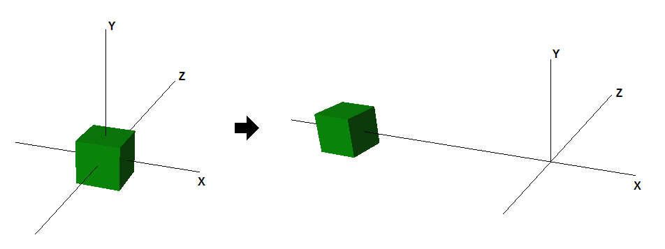

在3D中，空间通常是由一个原点和3个从原点出发的惟一轴X、Y和Z 所定义。在计算机图形中通常用到的空间有：对象空间、世界空间、视图空间、投影空间和屏幕空间。


## Rotation旋转
旋转是指围绕穿过原点的轴旋转顶点。三个这样的轴是空间中的X、Y和Z轴。2D中的一个示例是逆时针旋转向量(1,0)90度。旋转的结果是适量（0,1)。用于绕Y轴顺时针旋转ΐ度的矩阵如下所示
```
    cosΐ  0  -sinΐ   0
     0    1     0    0
    sinΐ  0   cosΐ  0
     0    0     0    1
```
下图演示了一个位置 原点的立方体绕Y轴旋转45度的效果
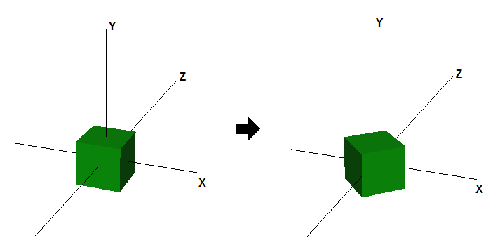

## Scaling缩放
缩放是指沿轴方向放大或缩小适量分量的大小。例如，适量可以沿着所有方向或仅沿X轴缩小。为了斡旋 缩放，我们通常以下缩放矩阵：
```
    p  0  0  0
    0  q  0  0
    0  0  r  0
    0  0  0  1
```
其中p、q和r分别是沿X、Y和Z方向的缩放因子。下图显示了沿X轴缩放2和沿Y轴缩放0.5的效果
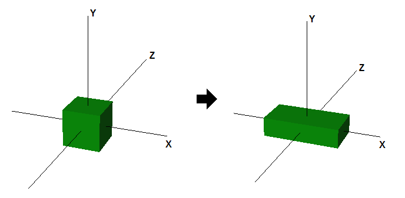

## 多个变换
要对一个向量应用多个变换，我们可以简单地将向量乘以第一个变换矩阵，然后将得到的向量乘以每二个变换矩阵，以此类推。因为向量和矩阵相乘是关联的，我们可以先将所有矩阵相乘，然后将向量乘以乘积矩阵，会得到相同的结果。下图显示了如果我们将旋转和平移变换结合在一起，立方体最终结果会是怎样：
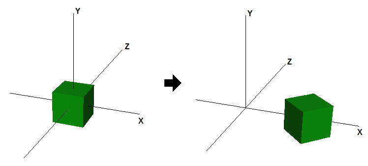

## 创建轨道
在本教程，我们将变换两个立方体。每一个将在原地旋转，而第二个将围绕第一个旋转，同时绕其自身旋转。这两个立方体将有自己的世界变换矩阵与其关联，并且该矩阵将在渲染的每一帧中重新被应用。

XNA Math中有一些函数可以帮助创建旋转、平移和缩放矩阵。

- 旋转。围绕X、Z和Z轴旋转，可以通过 这些函数完成XMMatrixRotationX, XMMatrixRotationY和XMMatrixRotationZ。它们创建了围绕一个主轴旋转的基础旋转矩阵。围其他轴的复杂旋转可以通过多个基础旋转矩阵相乘来完成。
- 平移。平移可以通过调用XMMatrixTranslation函数来完成。这个函数会创建一个平移矩阵。
- 缩放。缩放通过XMMatrixScaling完成。它只沿着主轴缩放。如果希望沿任意轴缩放，则可以将缩放矩阵与适应的旋转矩阵相乘，以实现该效果。

第一个立方体将在原地旋转，并作为轨道的中民。该 立方体沿Y轴旋转，该旋转与世界矩阵关联。这是通过调用XMMatrixRoationY函数实现的，如下代码所示。该立方体每帧旋转一个设定的量。由于假设立方体持续旋转，旋转矩阵所基于的值会随着每一帧而递增。

```C++
    // 1st Cube: Rotate around the origin
    g_World1 = XMMatrixRotationY( t );
```
每二个立方体会围绕第一个旋转。为了演示多个变换，将添加缩放因子 及其自的轴旋转。所使用的公式显示在代码的正下方（注释中）。首先，该立方体会被缩小到30%，然后它沿其旋转轴（本例中为Z轴）。为了模拟轨道，它将从原点平移，然后沿Y轴旋转。通过四个单独矩阵及其各自的变换(mScale,mSpin,mTranslate,mOrbit)，然后将其相乘，可以获得所需效果。
```
    // 2nd Cube:  Rotate around origin
    XMMATRIX mSpin = XMMatrixRotationZ( -t );
    XMMATRIX mOrbit = XMMatrixRotationY( -t * 2.0f );
    XMMATRIX mTranslate = XMMatrixTranslation( -4.0f, 0.0f, 0.0f );
    XMMATRIX mScale = XMMatrixScaling( 0.3f, 0.3f, 0.3f );
    g_World2 = mScale * mSpin * mTranslate * mOrbit;
```
需要注意的一点是，这些运算是不可交换的。变换的应用顺序很重要。实验变换的顺序并观察结果。

由于 所有变换函数都将根据参数创建一个新的矩阵，因此它们的旋转量必须递增。这是通过更新“时间”变量来完成的。
```C++
    // Update our time
    t += XM_PI * 0.0125f;
```
在进行渲染调用之前，必须更新着色器的常量缓冲区。请注意，世界矩阵对于每个立方体都是唯一的，因此，传递给它的每个对象都会发生变化。

```C++
    //
    // Update variables for the first cube
    //
    ConstantBuffer cb1;
    cb1.mWorld = XMMatrixTranspose( g_World1 );
    cb1.mView = XMMatrixTranspose( g_View );
    cb1.mProjection = XMMatrixTranspose( g_Projection );
    g_pImmediateContext->UpdateSubresource( g_pConstantBuffer, 0, NULL, &cb1, 0, 0 );

    //
    // Render the first cube
    //
    g_pImmediateContext->VSSetShader( g_pVertexShader, NULL, 0 );
    g_pImmediateContext->VSSetConstantBuffers( 0, 1, &g_pConstantBuffer );
    g_pImmediateContext->PSSetShader( g_pPixelShader, NULL, 0 );
    g_pImmediateContext->DrawIndexed( 36, 0, 0 );

    //
    // Update variables for the second cube
    //
    ConstantBuffer cb2;
    cb2.mWorld = XMMatrixTranspose( g_World2 );
    cb2.mView = XMMatrixTranspose( g_View );
    cb2.mProjection = XMMatrixTranspose( g_Projection );
    g_pImmediateContext->UpdateSubresource( g_pConstantBuffer, 0, NULL, &cb2, 0, 0 );

    //
    // Render the second cube
    //
    g_pImmediateContext->DrawIndexed( 36, 0, 0 );
```

## the Depth Buffer深度缓冲区
本教程另一个很重要的补充就是深度缓冲区。如果没有它，更小的那个立方体在去到更大的背面时，仍然会被画在更大的中间立方体的前面。深度缓冲区让Deirect3D可以跟踪很个被画到屏幕的像素的深度。Direct3D11的深度缓冲区的默认行为是对照存储在该 屏幕空间像素的深度缓冲区中的值检查绘制到屏幕的每个像素。如果正在渲染的像素的深度小于或者等于深度缓冲区中已经存在的值，则绘制该像素，并将深度缓冲区中的值更新为新绘制像素的深度。相反，如果待绘制的像素的深度比缓冲区中的深度值更大，该像素被忽略，并且深度缓冲区中的值保持不变。

下面的示例中的代码创建了一个深度缓冲区（DepthStencil texture)。它也创建了一个深度缓冲区对应的DepthStencilView，以便让Deirect3D11知道用它作为Depth Stencil texture。

```C++
    // Create depth stencil texture
    D3D11_TEXTURE2D_DESC descDepth;
    ZeroMemory( &descDepth, sizeof(descDepth) );
    descDepth.Width = width;
    descDepth.Height = height;
    descDepth.MipLevels = 1;
    descDepth.ArraySize = 1;
    descDepth.Format = DXGI_FORMAT_D24_UNORM_S8_UINT;
    descDepth.SampleDesc.Count = 1;
    descDepth.SampleDesc.Quality = 0;
    descDepth.Usage = D3D11_USAGE_DEFAULT;
    descDepth.BindFlags = D3D11_BIND_DEPTH_STENCIL;
    descDepth.CPUAccessFlags = 0;
    descDepth.MiscFlags = 0;
    hr = g_pd3dDevice->CreateTexture2D( &descDepth, NULL, &g_pDepthStencil );
    if( FAILED(hr) )
        return hr;

    // Create the depth stencil view
    D3D11_DEPTH_STENCIL_VIEW_DESC descDSV;
    ZeroMemory( &descDSV, sizeof(descDSV) );
    descDSV.Format = descDepth.Format;
    descDSV.ViewDimension = D3D11_DSV_DIMENSION_TEXTURE2D;
    descDSV.Texture2D.MipSlice = 0;
    hr = g_pd3dDevice->CreateDepthStencilView( g_pDepthStencil, &descDSV, &g_pDepthStencilView );
    if( FAILED(hr) )
        return hr;
```
为了用这个新创建的depth stencil buffer，本程序必须将其绑定到设备。这是通过把该depth sencil view会给OMSetRendertargets函数的每三个参数来完成的。
```C++
    g_pImmediateContext->OMSetRenderTargets( 1, &g_pRenderTargetView, g_pDepthStencilView );
```
与渲染目标一样，我们也必须在渲染之前 清除深度缓冲区。这确保了前一帧 的深度值不会错误地丢弃当前帧中的像素。在下面的代码中，教程实际上将深度缓冲区设置为最大值(1.0)。
```C++
    //
    // Clear the depth buffer to 1.0 (max depth)
    //
    g_pImmediateContext->ClearDepthStencilView( g_pDepthStencilView, D3D11_CLEAR_DEPTH, 1.0f, 0 );
```