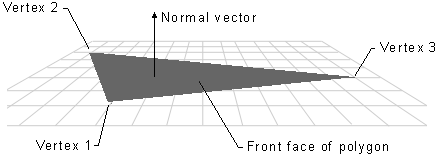

# RectTexture3D 在3D中画矩形
本示例用于显示，在D3D中展示一个矩形。并通过
- 调整模型中三角形各顶点的顺序，展示哪个面是正面，哪个面是反面。
- 调整CullMode，来决定是显示三角形的正面，还是显示三角形的反面。

通过本例下面的描述，自行调整参数，观察如何控制显示哪些三角形，不显示哪些三角形。

# 坐标系
D3D中，默认使用左手系。关于展示3D空间的示例可以参考[https://github.com/iherewaitfor/direct3d11demo#tutorial04-3d-spaces]。
关于坐标系的文件可以参考微软官方文档[https://learn.microsoft.com/en-us/windows/win32/direct3d9/coordinate-systems](https://learn.microsoft.com/en-us/windows/win32/direct3d9/coordinate-systems)


# 三角形的正面 及 法向量。
关于三角形中如何确认三角形的面，可以参考[https://learn.microsoft.com/en-us/windows/win32/direct3d9/face-and-vertex-normal-vectors](https://learn.microsoft.com/en-us/windows/win32/direct3d9/face-and-vertex-normal-vectors)。

使用左手，四指按三角形三个顶点的顺序握手，大拇指指向的方向即为该三角形的正面方向（法向量指向）。默认情况下，D3D只显示正面的三角形（反面不可见）。眼睛（相机）迎面看着的正面，为显示的面。或者描述为大拇指指向了眼睛为可见，反之不可见。



# 编程示例
涉及模型三角形顺序、视图矩阵、CullMode等

## 模型三角形顺序
本示例使用了一个矩形。下面是矩形的四个点。

```C++
    // Create vertex buffer
    SimpleVertex vertices[] =
    {

        { XMFLOAT3(-1.0f, 1.0f, 0.0f), XMFLOAT2(0.0f, 0.0f) }, //左上  A
        { XMFLOAT3(1.0f, 1.0f, 0.0f), XMFLOAT2(1.0f, 0.0f) },  //右上  B
        { XMFLOAT3( -1.0f, -1.0f, 0.0f ), XMFLOAT2( 0.0f, 1.0f ) },//左下 C
        { XMFLOAT3( 1.0f, -1.0f, 0.0f ), XMFLOAT2( 1.0f, 1.0f ) }, //右下D
    };
```
使用索引点描述 两个三角形。第一个三角形为0、1、2， 第三个三角形为2、1、3。按着顶点顺序握手即可得到三角形的正面方向。

```C++
    // Create index buffer
    WORD indices[] =
    {
        0, 1, 2,
        2, 1, 3
    };
```

基元的拓扑值，使用D3D11_PRIMITIVE_TOPOLOGY_TRIANGLELIST。每三个点（这里使用索引）表示一个三角形。
```C++
    // Set primitive topology
    g_pImmediateContext->IASetPrimitiveTopology( D3D11_PRIMITIVE_TOPOLOGY_TRIANGLELIST );
```
最后画时，使用索引进行Draw。
```C++
    g_pImmediateContext->DrawIndexed( 6, 0, 0 );
```

## 视图矩阵
视图矩阵，决定了我们怎么观察模型。眼睛在哪个位置，看向哪个方向，什么方向为向上方向。
在本例中，眼睛在(0,0,-5)，即正好在在Z轴-5的方向。看向的点是(0,0,0)，即原点位置。正Y轴为向上方向。这样，我们观察以上矩形时，正好都是看到矩形的这两个三角形的正面。
```C++
   // Initialize the view matrix
    XMVECTOR Eye = XMVectorSet( 0.0f, 0.0f, -5.0f, 0.0f );
    XMVECTOR At = XMVectorSet( 0.0f, 0.0f, 0.0f, 0.0f );
    XMVECTOR Up = XMVectorSet( 0.0f, 1.0f, 0.0f, 0.0f );
    g_View = XMMatrixLookAtLH( Eye, At, Up );
```
## CullMode，默认为D3D11_CULL_BACK
默认情况下，D3D是显示三角形的正面。也可以通过接口设置成反面。

其中CullMode值为D3D11_CULL_BACK时（清除反面），显示正面（默认情况，不调用接口设置就是这种）。CullMode值为D3D11_CULL_FRONT时（清除正面），显示反面。

具体代码操作如下。使用[ID3D11Device](https://learn.microsoft.com/en-us/windows/win32/api/d3d11/nn-d3d11-id3d11device)::[CreateRasterizerState](https://learn.microsoft.com/en-us/windows/win32/api/d3d11/nf-d3d11-id3d11device-createrasterizerstate)初始光栅化描述数据，然后使用[ID3D11DeviceContext](https://learn.microsoft.com/en-us/windows/win32/api/d3d11/nn-d3d11-id3d11devicecontext)::[RSSetState](https://learn.microsoft.com/en-us/windows/win32/api/d3d11/nf-d3d11-id3d11devicecontext-rssetstate)进行设置。

其中核心相关参数填写：

[D3D11_RASTERIZER_DESC](https://learn.microsoft.com/zh-cn/windows/win32/api/d3d11/ns-d3d11-d3d11_rasterizer_desc)中的

CullMode
- D3D11_CULL_BACK。清除反面。正面显示。该值为D3D的默认值。
- D3D11_CULL_FRONT。清除正面，反面显示。
- D3D11_CULL_NONE。不清除，无论看到该三角形的正面还是反面，都显示该三角形。

FrontCounterClockwise： 正面是否为逆时针方向。该值填false。我们上面填的顶点顺序是按顺时针方向排序的。若此值为true，则三角形的正反面正好反过来。

```C++
	D3D11_RASTERIZER_DESC rasterDesc;
	// 设置光栅化描述，指定多边形如何被渲染.
	rasterDesc.AntialiasedLineEnable = false;
	//rasterDesc.CullMode = D3D11_CULL_FRONT;
	rasterDesc.CullMode = D3D11_CULL_BACK;
    //rasterDesc.CullMode = D3D11_CULL_NONE;
	rasterDesc.DepthBias = 0;
	rasterDesc.DepthBiasClamp = 0.0f;
	rasterDesc.DepthClipEnable = true;
	rasterDesc.FillMode = D3D11_FILL_SOLID; //D3D11_FILL_SOLID
	rasterDesc.FrontCounterClockwise = false;
	rasterDesc.MultisampleEnable = false;
	rasterDesc.ScissorEnable = false;
	rasterDesc.SlopeScaledDepthBias = 0.0f;
	ID3D11RasterizerState* rasterState = NULL; //渲染状态
	// 创建光栅化状态
	hr = g_pd3dDevice->CreateRasterizerState(&rasterDesc, &rasterState);
	if (FAILED(hr))
	{
		return hr;
	}
	//设置光栅化状态，使其生效
	g_pImmediateContext->RSSetState(rasterState);
```

## 


# 参考
[https://learn.microsoft.com/en-us/windows/win32/direct3d9/face-and-vertex-normal-vectors](https://learn.microsoft.com/en-us/windows/win32/direct3d9/face-and-vertex-normal-vectors)

[https://learn.microsoft.com/en-us/windows/win32/direct3d9/coordinate-systems](https://learn.microsoft.com/en-us/windows/win32/direct3d9/coordinate-systems)

[https://learn.microsoft.com/en-us/windows/win32/api/d3d11/nn-d3d11-id3d11device](https://learn.microsoft.com/en-us/windows/win32/api/d3d11/nn-d3d11-id3d11device)

[https://learn.microsoft.com/en-us/windows/win32/api/d3d11/nf-d3d11-id3d11device-createrasterizerstate](https://learn.microsoft.com/en-us/windows/win32/api/d3d11/nf-d3d11-id3d11device-createrasterizerstate)

[https://learn.microsoft.com/en-us/windows/win32/api/d3d11/ns-d3d11-d3d11_rasterizer_desc](https://learn.microsoft.com/en-us/windows/win32/api/d3d11/ns-d3d11-d3d11_rasterizer_desc)

