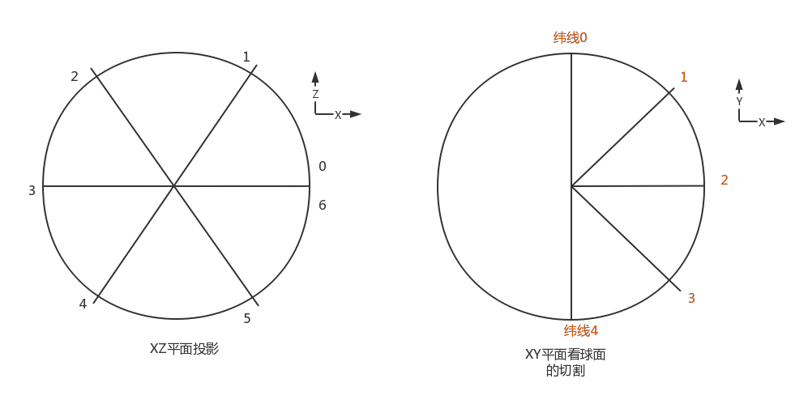
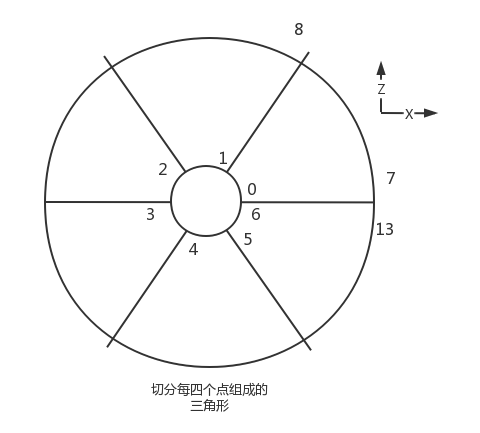

- [如何切割一个圆。](#如何切割一个圆)
  - [切分各顶点位置计算](#切分各顶点位置计算)
    - [顶点切分示意图](#顶点切分示意图)
    - [位置计算 及纹理映射](#位置计算-及纹理映射)
    - [使用顶点构建模型（构建三角形索引）](#使用顶点构建模型构建三角形索引)
  - [纹理映射](#纹理映射)


# 如何切割一个圆。

## 切分各顶点位置计算
怎么切分圆。
从正Y轴，垂直看向XZ平面看，一个圆被切看成sw份，比如切成6份。总共切了7次，其中第1次和每7次位置重叠（方便纹理映射）
从负Z轴，垂直看向XZ平面，一个半圆被切成Sj份，比如切成 4份。包括两边的点，共有5个点。

设置球的半径为r，

则计算为
```C++
// float radius; //半径
// int numSlices;  //纵切多少份。
// int numStacks;  //横切多少份
void MakeSphere(VertexList& vertices, IndexList& indices, float radius, int numSlices, int numStacks) {

    //生成顶点
    for (int j = 0; j < numStacks + 1; j++) { 
        float xyStep = j * (XM_PI / numStacks); // 0-PI
        float xyR = radius * sinf(xyStep);   
        float tempY = radius * cosf(xyStep);
        float texY = xyStep / XM_PI;
        if (j == numStacks) { //由于存在浮点数计算精度差，修复南极点（及每个纬线圈接缝处）的位置和纹理坐标。
            xyR = 0.0f;
            tempY = -radius;
            texY = 1.0f;
        }
        for (int i = 0; i <= numSlices; i++) {
            float xzStep = 2.0f * XM_PI / numSlices * i;  // 0 - 2PI

            VertexType v;
            v.position.x = xyR * cosf(xzStep);
            v.position.y = tempY;
            v.position.z = xyR * sinf(xzStep);

            //从球面坐标，映射到纹理坐标
            //1. 从球内（眼睛在原点）向球内表面的视角：1.0f - xzStep / (2.0f * XM_PI); 
            //2. 若是从球外，看球表面，则为v.texture.x = xzStep / (2.0f * XM_PI); 
            v.texture.x = 1.0f - xzStep / (2.0f * XM_PI); 
            v.texture.y = texY;
            if (i == numSlices) {
                //修复接缝处纹理。
                v.texture.x = 0.0f;
            }
            vertices.push_back(v);
        }
    }
    // 使用索引生成组成球面的三角形。
    for (int j = 0; j < numStacks ; ++j)
    {
        int offset = j * (numSlices + 1);
        for (int i = 0; i < numSlices; ++i)
        {
            //由于全景视频时，是由球的里面往外看。所以此处三角形使用 逆时针顺序取顶点
            //第一个三角形。
            int index = i + offset;
            indices.push_back(index);
            indices.push_back(index + (numSlices + 1));
            indices.push_back(index + (numSlices + 1) + 1 );

            //第二个三角形
            indices.push_back(index);
            indices.push_back(index + (numSlices + 1) + 1);
            indices.push_back(index + 1);
        }
    }
}
```

### 顶点切分示意图



例如：我们从纵向将球面切成6份，从横向将球面切成4份，

纵向分析：（投影到XZ平面）

则每个纬线圆上 共有 7 个点。其中每个纬线圆上，头尾的点（比如0、6两点）位置相同。这是为了解决纹理映射，其中纬线圆起点（比如0点、7、14等）的纹理坐标横坐标0。纬结圆终点（比如6、13、20等）的纹理坐标横坐标值为1。

横向分析：

看上图，横向把球面切成4份。考虑纹理映射所需，南北极点都有纬线圆，一共有5个纬线圆。每个纬线圆有7个点，一共有7X5=35个顶点。特别的其中同一极点（比如北极）纬线圆上的顶点，位置坐标相同，只是纹理横坐标不同，以便准确进行纹理映射。
### 位置计算 及纹理映射

位置计算：

从北极点看各个纬线圆与球心的连线，然后与Y轴正轴的夹角xyAngle依次是0、PI/4、2PI/4、3PI/4、PI。计算各纬线圆的半径为xyR = radius \* sinf(xyAngle); 

而顶点位置的y值为position.y = radius \* cos(xyAngle)

纹理坐标值纵坐标为 texture.y =xyAngle/PI

各纬线圆被切成了6分，各个切点（0、1、2、3、4、5、6）与圆心的连线与X轴正轴的夹角zxAngle依次为0、2PI/6、2\*2PI/6、3\*2PI/6、4\*2PI/6、5\*2PI/6、6\*2PI/6。

由此计算
position.x = xyR \* cos(zxAngle)

posiong.z = xyR \* sin(zxAngle)

纹理坐标横坐标值为texture.x = 1 - zxAngle/2PI。


注意考虑浮点数的计算精度差，南极点的坐标要进行修正，其y值为-1.0
各纬线圆的终点纹理坐标值也需要修正为0


### 使用顶点构建模型（构建三角形索引）



切分了5个纬线圆后，开始构建三角形索引。

我们以北极点开始数第一、二个纬线圈上的顶点构建三角形。

第一个纬线圆上的点分别是0，1，2，3，4，5，6

第二个纬线圆上的点分别是7，8，9，10，11，12，13

以0、7、8，1为例，取两个三角形（逆时针），分别为
- 0、7、8
- 0、8、1

上图中的圆是从球外视角（从北极点上空看下来）看的投影。此处逆时针取三角形，这样从球内原点看，刚好是顺时针的（三角形正面）。这样cullmode的值，直接用默认值(D3D11_CULL_BACK)的就可以了。

若此处直接顺利针对三角形
- 0、8、7
- 0、1、8

则对应的cullmode值取D3D11_CULL_FRONT，可做到同样效果。或者不改cullmode, 修改FrontCounterClockwise为true。


## 纹理映射
从球面坐标  映射到 纹理平面横纵坐标。
设球面描述范围为
- sx：横切面上的角度，取值范围为[0,2PI]
- sy: 纵切面上的角度，取值范围为[0,PI]，北极点取0，南极点取PI

纹理坐标为tx,xy，取范围均为[0,1]

但由于是从球内角度看，所以横坐标映射为[0,2PI]对应[1,0]

纵坐标无论不受内外影响，都是[0,PI]对应[0,1]

则两者之间的映射关系为

sx对应1-tx，sy对应ty
